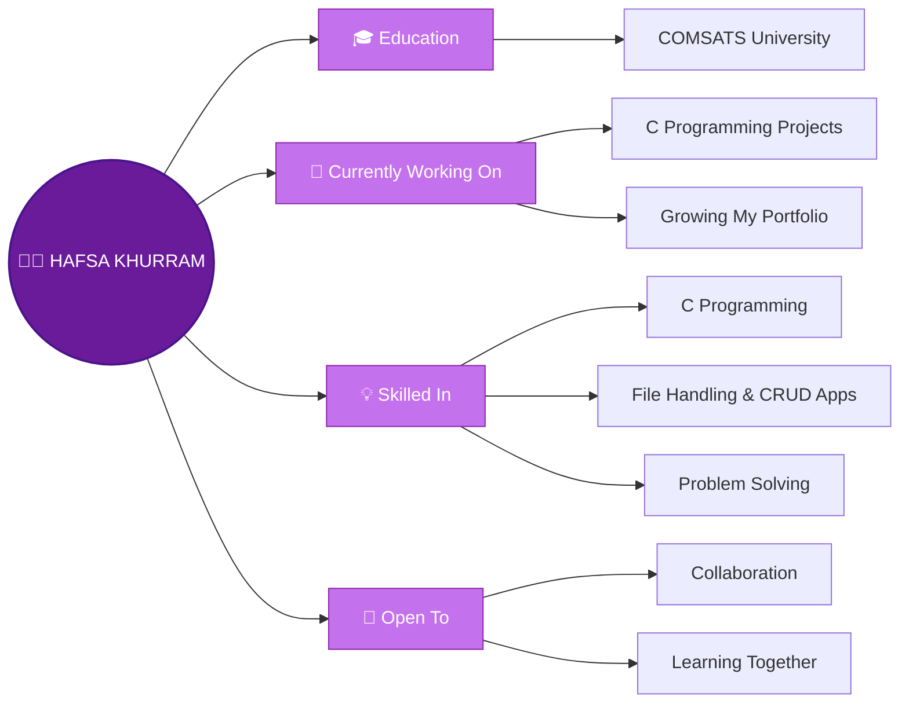

<!-- Header -->

<h1> Hi there! I'm Hafsa Khurram</h1>

  
  

---

##  About Me

> *"Every great developer you know got there by solving problems they were unqualified to solve until they actually did it."*  
> — Patrick McKenzie

---

## 🛠️ Tech Stack & Skills

### 💻 Programming Languages

### 🔧 Tools

---

## 🚀 Featured Project

| Project | Description | Tech |
|:--|:--|:--:|
| 🏦 **[Banking System](https://github.com/Hafsa-Khurram/Programming-Fundamental)** | Console banking app: PIN-protected ATM (balance, withdraw, deposit, fast cash) and customer records with full CRUD and file storage |  |

---

## 📊 GitHub Stats

<table>
  <tr>
    <td width="50%" valign="top">
      
       
      
       
      
    </td>
    <td width="50%" valign="center">
      
    </td>
  </tr>
</table>

---

## 📈 Activity Graph

---

## 🎯 Current Focus

- 🛠️ **Building:** Practical projects to grow my portfolio
- 📚 **Learning:** New tools and languages every day
- ⚡ **Fun fact:** I enjoy turning ideas into working programs

---

## 🎮 Pacman Contribution Graph

  <picture>
    <source media="(prefers-color-scheme: dark)" srcset="https://raw.githubusercontent.com/Hafsa-Khurram/Hafsa-Khurram/output/pacman-contribution-graph-dark.svg" />
    <source media="(prefers-color-scheme: light)" srcset="https://raw.githubusercontent.com/Hafsa-Khurram/Hafsa-Khurram/output/pacman-contribution-graph.svg" />
    
  </picture>

---

## 📫 Let's Connect!

**Always happy to connect, learn and build something together!**

